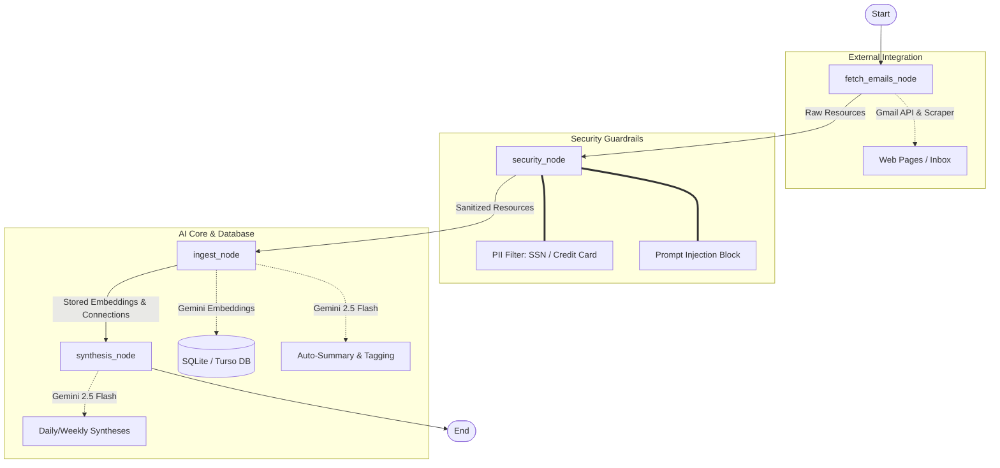

# Second Brain Agent: Intelligent Personal Knowledge Concierge

This repository contains the **Second Brain Agent**, built using the Google Agent Development Kit (ADK) and the Gemini GenAI SDK. It is designed to act as an automated personal knowledge assistant—scraping incoming emails, securing sensitive data, embedding/tagging knowledge, finding semantic connections, and generating periodic digests.

---

## 🎯 Selected Track
**Concierge Agents** (also highly applicable to **Agents for Business**)
- The agent serves as a personal reading, research, and interest tracker, curating summaries, generating newsletters/digests, and showing connections between disparate sources of information.

---

## 📋 Technical Requirements Checklist

- [x] **Agent / Multi-agent system (using ADK)**: Core agent logic is modeled as an ADK `Workflow` graph containing multiple connected processing nodes.
- [ ] **Model Context Protocol (MCP) Server integration**: *Planned* (The agent's FastAPI backend serves REST APIs which are primed for simple wrapping into an MCP server to expose tools to Claude/Cursor).
- [x] **Agent Skills**: Core skills include:
  - Gmail polling and automated webpage content extraction.
  - Automatic summarization and keyword tag extraction via `gemini-2.5-flash`.
  - Vector embedding generation via `text-embedding-004`.
  - Local semantic vector search (cosine similarity calculation) to find connections between articles.
- [x] **Security Features**:
  - **PII Scrubbing**: Active pattern matches to detect and redact SSNs and credit card numbers from incoming text before any LLM APIs are called.
  - **Prompt Injection Defense**: Filters untrusted web scrapes/emails for adversarial triggers (e.g. *"ignore previous instructions"*, *"bypass security checkpoint"*) and neutralizes/flags them.
- [x] **Deployability**: Complete with FastAPI backend, beautiful dark-mode UI, Dockerfile, and Terraform GCP infrastructure files.

---

## 🛠️ System Architecture & Workflow

The agent uses a structured pipeline built with the ADK workflow engine:



### 1. Ingestion Node (`fetch_emails_node`)
Polls Gmail or accepts manual inputs. It parses email bodies, follows links to scrape their text contents, and outputs them as raw resource dictionaries.

### 2. Guardrails Node (`security_node`)
Ensures secure operation by:
- Regex-filtering and redacting SSN (`###-##-####`) and Credit Card (`####-####-####-####`) formats.
- Detecting prompt injection sequences and prepending a block warning while disabling downstream LLM API triggers for that resource.

### 3. Ingestion & Vector Search Node (`ingest_node`)
- Calls `text-embedding-004` to embed clean text.
- Calls `gemini-2.5-flash` to extract tags and summarize.
- Stores the data in a SQLite database (with optional cloud replication via Turso).
- Computes dot products (cosine similarity) locally against all past resources to spot semantic linkages.
- Prompts Gemini to describe the relationship between linked articles in 2 sentences and stores the relationship.

### 4. Synthesis Node (`synthesis_node`)
Retrieves newly tracked interests and compiles them into a markdown-formatted daily or weekly synthesis showing trends, recurring patterns, and suggestions for future research.

---

## 🚀 Quick Start (Local Development)

### 1. Prerequisites
Ensure you have the following installed:
* [uv](https://docs.astral.sh/uv/) (Fast Python package/dependency manager)
* [Google Cloud SDK](https://cloud.google.com/sdk) (Authenticated to GCP)

### 2. Installation
First, install the Google Agents CLI tool:
```bash
uv tool install google-agents-cli
```

Navigate to the agent directory and install dependencies:
```bash
cd second-brain-agent
agents-cli install
```

### 3. Environment Setup
Configure your environment variables. Copy `.env.example` to `.env` and fill in your keys:
```bash
cp .env.example .env
```
Ensure you provide:
* `GEMINI_API_KEY`: Your Google Gemini API Key.
* `GMAIL_EMAIL` / `GMAIL_PASSWORD`: Optional, for automated email crawling.
* `TURSO_DATABASE_URL` / `TURSO_AUTH_TOKEN`: Optional, if you wish to use a cloud Turso SQLite database (otherwise defaults to local SQLite).

### 4. Running the Dashboard
Launch the FastAPI development environment:
```bash
agents-cli playground
```
This runs the local server at `http://localhost:8000`. Open it in your browser to view the interactive dark-mode dashboard where you can:
* View all resource items, summaries, and extracted tags.
* Visualize semantic connections between articles.
* Manually insert custom notes/URLs.
* Trigger daily/weekly synthesis cycles manually.

### 5. Running Tests
Run the automated test suite to verify correct behavior:
```bash
uv run pytest tests/unit tests/integration
```

---

## 🌐 Deployment (GCP Cloud Run)

To deploy the Second Brain Agent directly to Google Cloud:
1. Configure your active GCP project:
   ```bash
   gcloud config set project <your-project-id>
   ```
2. Deploy the agent using the CLI:
   ```bash
   agents-cli deploy
   ```

*Note: Infrastructure files and Terraform configurations can be found inside the [second-brain-agent/deployment/](file:///c:/Users/qdang/Desktop/Antigravity_5%20Days%20AI%20Agents/capstone-project-agent-os/second-brain-agent/deployment) directory.*
